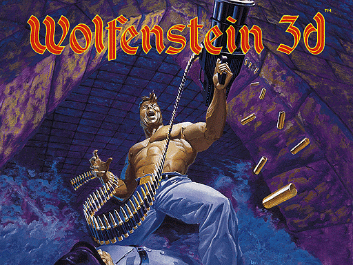
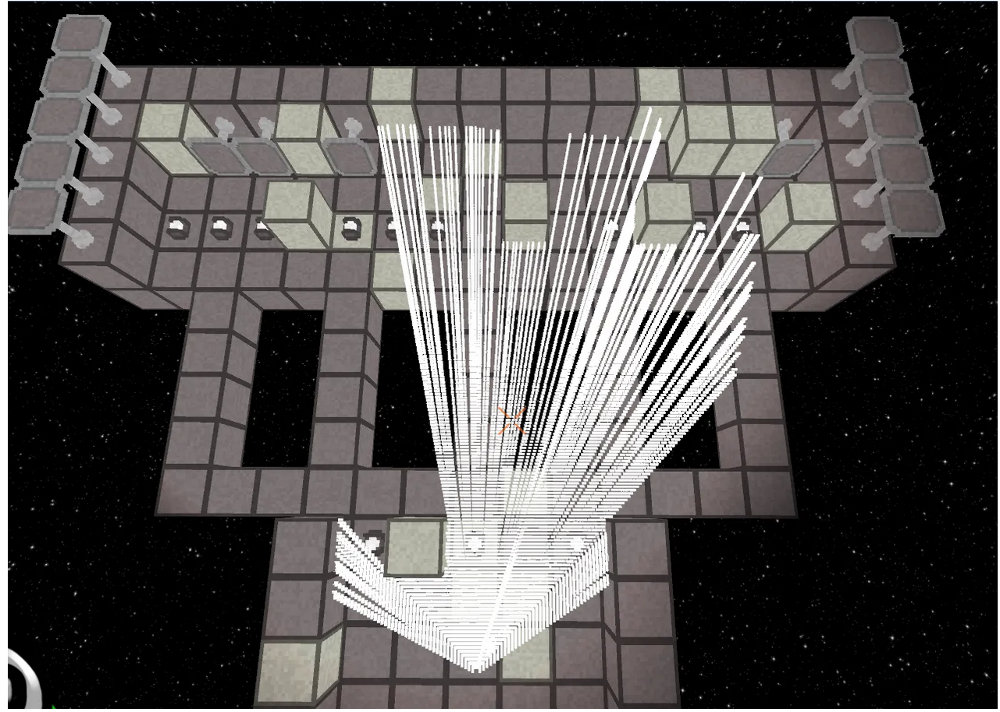

# Cub3d

Exploring Computer Graphics Basics by Replicating the Classic Game Wolfenstein 3D

<p align="center">
  
</p>

## Key Concepts

- SDL
- Computer Graphics
- Raycasting
- Vectors
- Matrices
- DDA algorithm

## Raycasting

- Raycasting is a technique used in computer graphics and computational geometry to determine the intersection of a ray with objects in a virtual environment.

- Ray casting lies at the heart of Cub3D, enabling the creation of a 3D environment using 2D graphics techniques. By simulating the projection of rays from the player’s viewpoint, we can achieve the illusion of depth and perspective. With a bit of fancy math, we can transform those rays into visible walls, and finally — with a bit more math — into textures.

<p align="center">
  
</p>


## Game

- Wall Collisions
- Minimap system
- Open and close doors
- Animated sprites
- Rotate with mouse
- Create enemies
- Render floor and ground

<p align="center">
  
</p>


# How to run

```
# Install SDL2 and SDL2-images
sudo apt-get install libsdl2-dev
sudo apt-get install libsdl2-image-dev

# To run the mandatory part
cd mandatroy
make
./cub3d.out ./resources/maps/1.cub

# To run the bonus part
cd bonus
make
./cub3d.out ./resources/maps/2.cub
```

## Resources
- [Subject](./static/Cub3d.pdf)
- [DDA](https://www.youtube.com/watch?v=NbSee-XM7WA&ab_channel=javidx9)
- [Vectors](https://www.youtube.com/watch?v=fNk_zzaMoSs)
- [Rotation matrices](https://www.youtube.com/watch?v=S0uzwDKqnsw&ab_channel=JeffreyChasnov)
- [Raycasting](https://lodev.org/cgtutor/raycasting.html)
- [Wolf3d](http://wolf3d.atw.hu/)
- [Explaination](./static/1.pdf)
- [cub3d](https://medium.com/@afatir.ahmedfatir/cub3d-tutorial-af5dd31d2fcf)

